# asp-net-google-authentication
### Documentation how to add external login in aspnet core

### Create project

1. Open Visual Studio 2022 and click on `create new project`

2. Select `ASP.NET Core Web App`

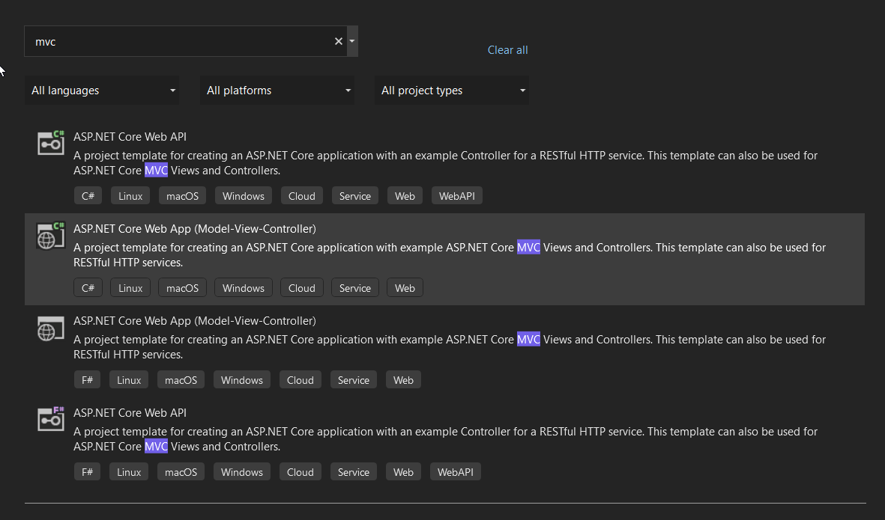

3. Give project details

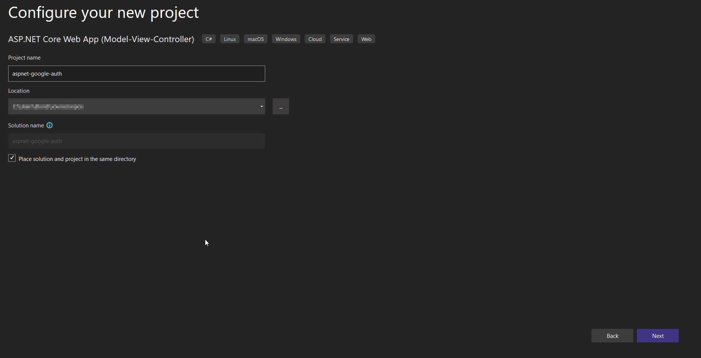

4. Select framework to `.NET 6.0` and Authentication type to `Individual Accounts`

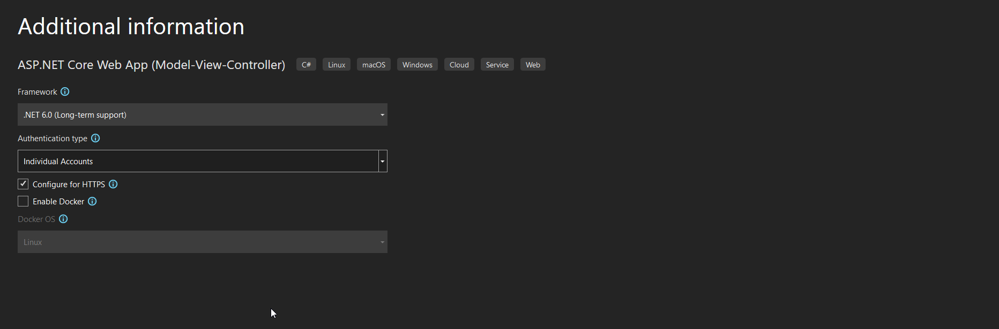

### Add migrations

1. Open `Tools -> Nuget Packaget Manager -> Package Manager Console`

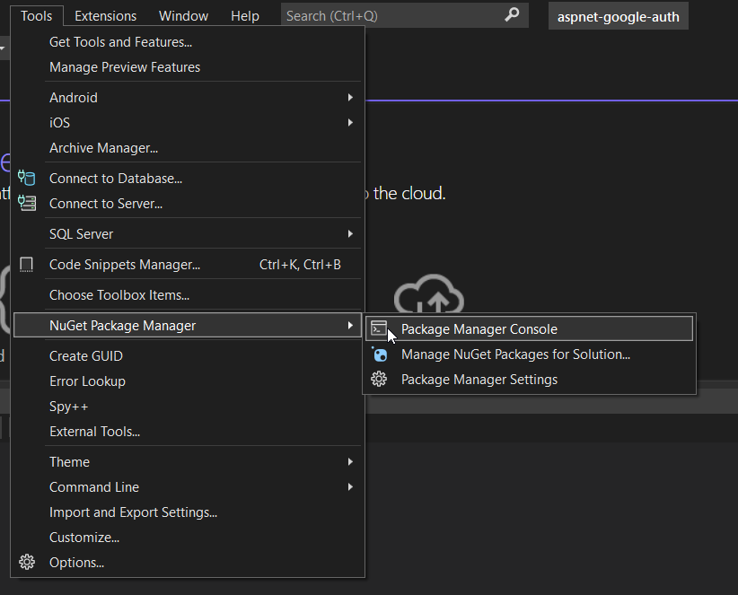

2. Add migration using the command: `add-migration <Name Of Migration>`

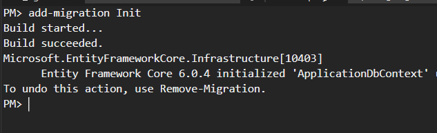

3. Update database using the following command: `update-database`

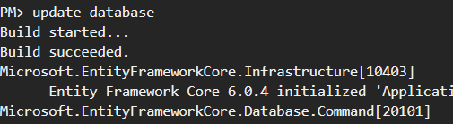

4. To see the result navigate to Views -> `SQL Server Object Explorer`

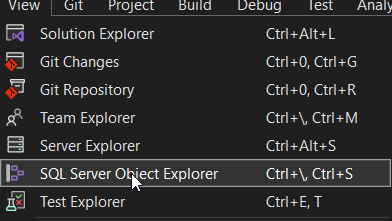

5. Find the database which is similar with the name of the project

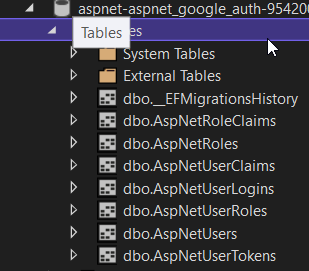

### Add Google Authentication Package

1. Open `Tools -> Nuget Packaget Manager -> Package Manager Console`


2. Install Google Authentication package using this command: `Install-Package Microsoft.AspNetCore.Authentication.Google -Version 6.0.4`

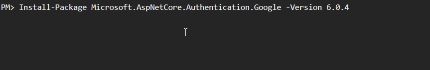

### Add secret keys

1. Open `Tools -> Command Line -> Developer Command Prompt`

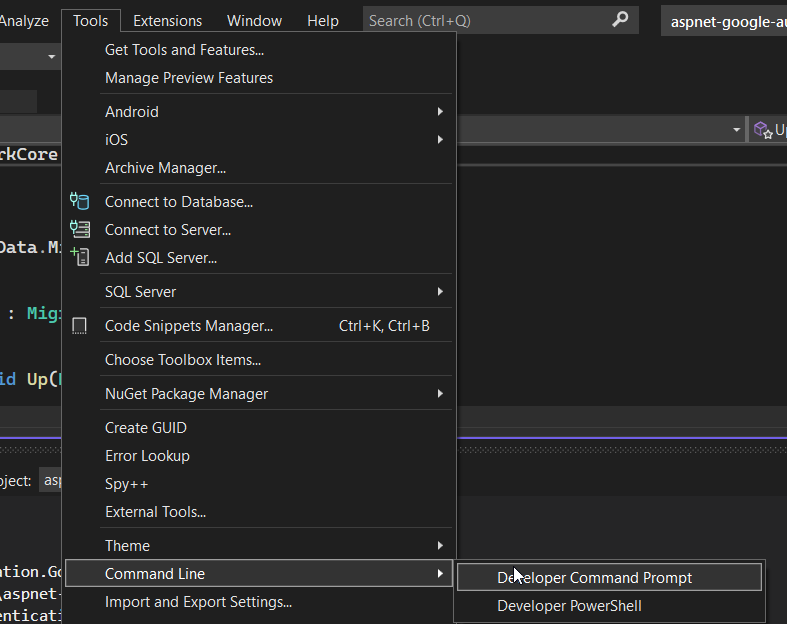

2. Init secret keys by using this command: `dotnet user-secrets init`

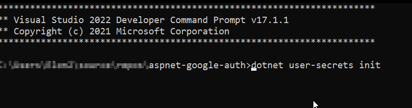


### Google Api
1. To get the credentials visit: `https://console.cloud.google.com/apis/credentials`


2. Click on the `CREATE PROJECT`

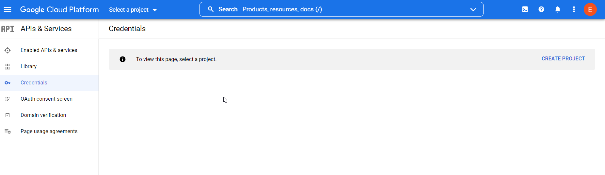

3. Add project details and `create` the project

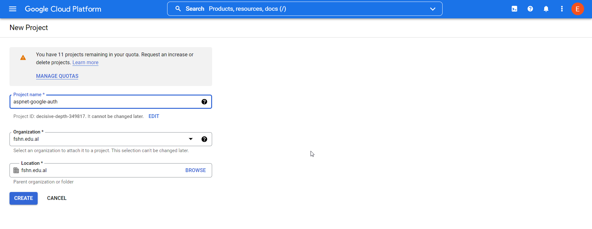

4. Navigate to `Configure consent screen`

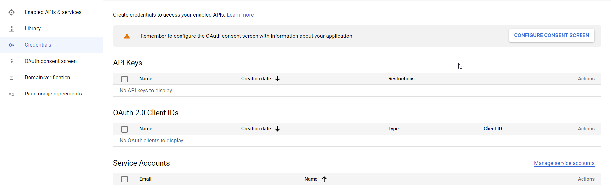

5. Choose user type `(I have selected the Internal)`

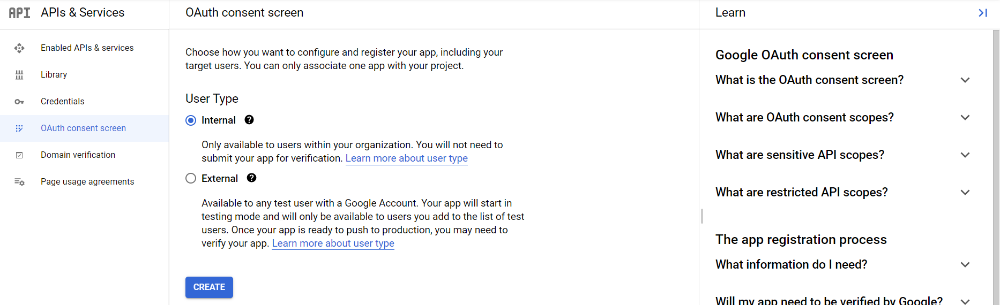

6. Add your app details

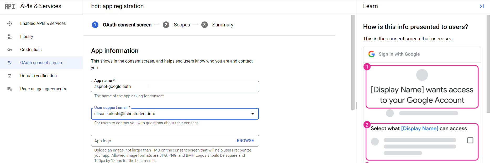

7. Set your app domain information: `https://localhost:{port}`

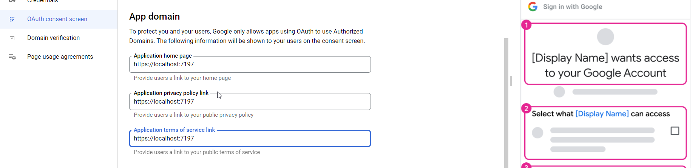

8. Add your developer information

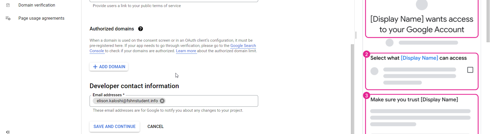


9. Navigate to `Credentials` and click on `CREATE CREDENTIALS` and select OAuth client ID

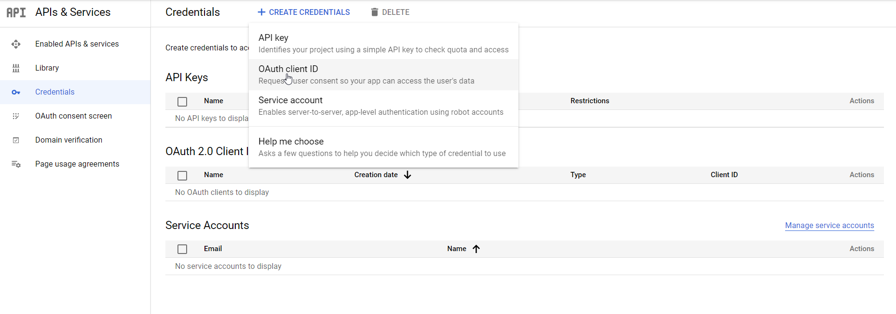

10. Select as an Application Type the `Web application` option

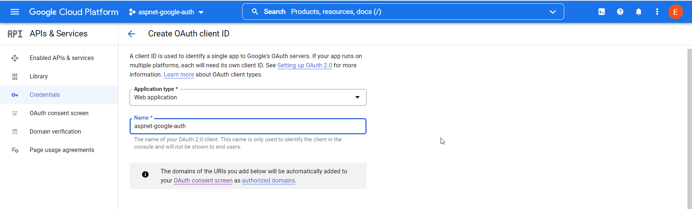

11. Add `Authorized Javascript origins` and `Authorized redirect URIs` and click `create`

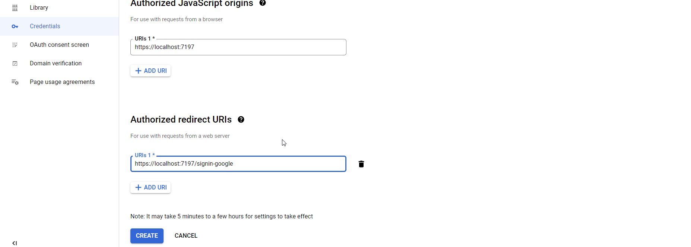

12. See your secret keys

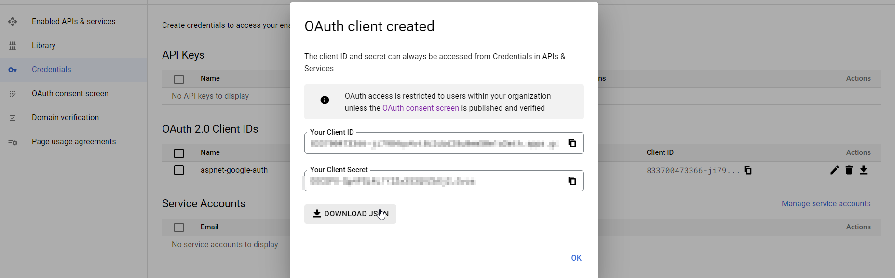

### Add secret keys in the app

1. Open `Tools -> Command Line -> Developer Command Prompt`


2. Type the following commands:

`dotnet user-secrets set "Authentication:Google:ClientId" <Client Id thay you get from Google>`

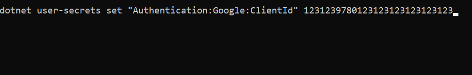

`dotnet user-secrets set "Authentication:Google:ClientSecret" <Client Secret thay you get from Google>`

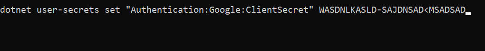

3. Edit Program.cs file and add the following content

```
var services = builder.Services;
var configuration = builder.Configuration;
 
services.AddAuthentication().AddGoogle(googleOptions =>
{
    googleOptions.ClientId = configuration["Authentication:Google:ClientId"];
    googleOptions.ClientSecret = configuration["Authentication:Google:ClientSecret"];
});

```

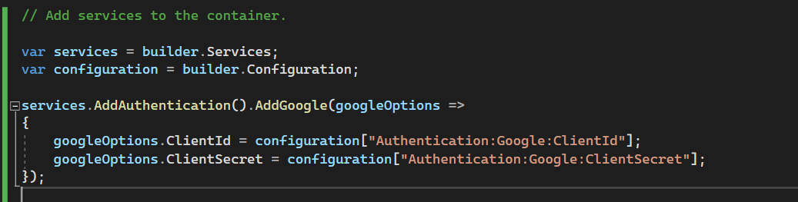


### Run the app

`1. Click on green icon`

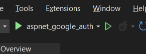

`2. Navigate to register and click on the Google button`

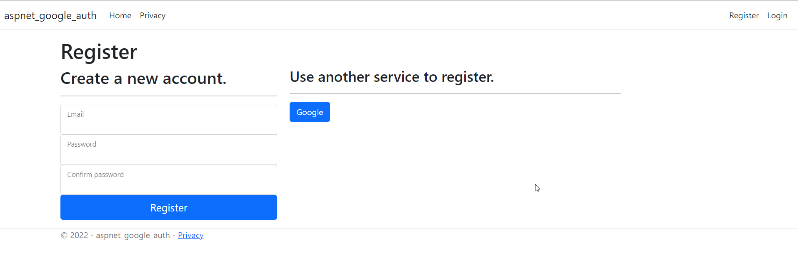

3. Choose account

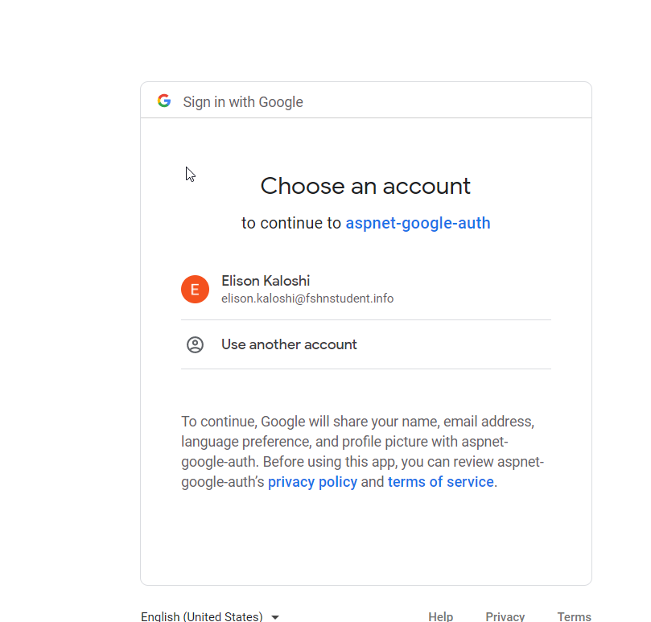

4. Click on register

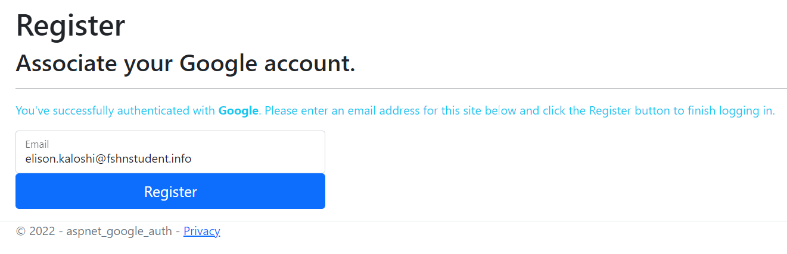

5. Click on: `Click here to confirm your account`

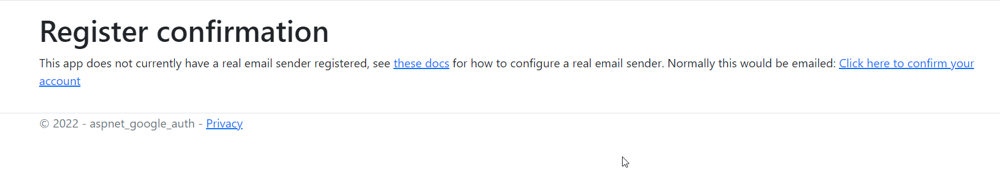

6. Navigate to login and click on `Google`

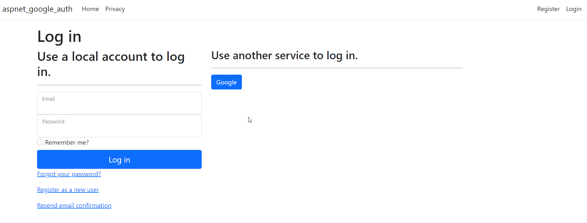

7. You will be automatically logged in 

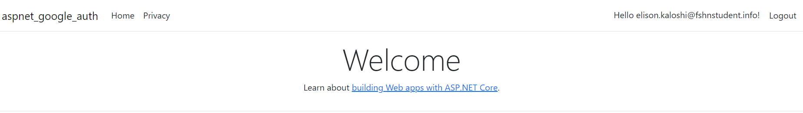


